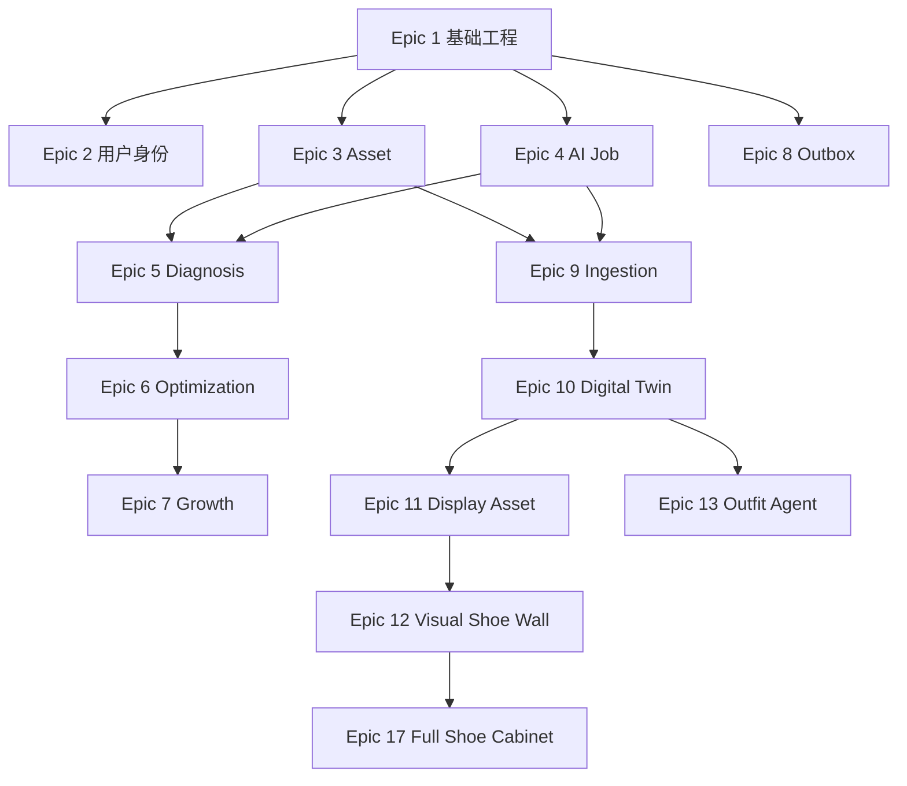

# AI Wardrobe 研发计划与 WBS V1.1

## 一、研发策略
P0a → P0b → Hardening → P0.5 → P1 → P1.5 → Phase 2。
每个阶段先验证明确假设，再进入下一阶段。
AI 调优不需要等 P0a 完全结束：工程轨（P0a）和 AI Eval 轨（Offline Dataset 调 Prompt）可双轨并行。

## 二、P0a：Infrastructure Foundation（建议 2 周）
Epic 1 基础工程：Backend、Mini Program、PostgreSQL、Redis、COS、CI/CD。
Epic 2 用户身份：微信登录、Internal User ID。
Epic 3 Asset：Upload Ticket、Direct Upload、Asset Registry、Upload Validation。
Epic 4 AI Job：GenerationJob、AIInvocation、Celery、Idempotency、Job Status UX、Credits Reserve/Release。
Epic 8 Outbox：Outbox Table、Dispatcher（FOR UPDATE SKIP LOCKED）、Reliability Monitor。

同期启动 Offline AI Eval：提前用离线 Dataset 调 Prompt，不阻塞工程进度。

## 三、P0b：AI Experience（建议 2～3 周）
Epic 5 Diagnosis：Structured Output、Result UI、SLO 渐进展示（文字先行 → 图片后续）。
Epic 6 Optimization：Plan、Image Edit、Critic、Before/After。
Epic 7 Growth：Share、SceneCode、A/B Vote。

总 P0（P0a + P0b）：4～5 周更现实。

### P0 Hardening Sprint（3～5 天）
P0b 完成后进入 Hardening Gate：
- P0 blocker bug = 0
- P1 critical bug 有明确 owner
- 日志齐全
- 核心路径 integration test
- Prompt Version 化
- Migration 审核
- 成本复盘
- Rate Limiting 就位
- Quota 基线就位
- Backup 恢复演练完成

通过后进入 30～50 人封闭测试，再开始 P0.5。

## 四、P0.5：建库与视觉资产（建议 2～3 周）
Epic 9 Universal Ingestion：Product Link、Text Parsing、Screenshot Fallback、Snapshot。
Epic 10 Digital Twin：WardrobeItem、Observation、Evidence、Alias、Resolution。
Epic 11 Display Asset：Cutout、Anchor、Content Bounds、Quality Tier。
Epic 12 Visual Shoe Wall：Scene、Layout、Snapshot、Hotspot、Detail。

## 五、P1：Personal Stylist（建议 4～6 周）
Epic 13 Outfit Agent。
Epic 14 Look + Try-On。
Epic 15 WearEvent。
Epic 16 PreferenceSignal + Time Decay + StyleProfile。
Epic 17 Full Shoe Cabinet + AI View。

## 六、P1.5：长期留存（建议 4～6 周）
Visual Wardrobe、Laundry、Weekly Planning、Old Clothes Revival、AI Closet Organization。

## 七、Phase 2：商业化
Wardrobe Gap、Purchase Intelligence、Recommendation、Product Try-On、CPS/B2B2C、Friend Styling、Order Import、credit_ledger。

## 八、Epic 依赖关系

Epic 1-4、8 可部分并行（身份、资产、Job 基础不严格串行）。

## 九、Sprint
2 周一个 Sprint。
每个 Sprint 必须交付：
- 可运行功能
- Demo
- 埋点数据
- Bug List
- ADR
- Next Backlog

## 十、Hardening Sprint
每个大 Phase 后预留 3～5 天 Hardening Sprint（不是每个 Sprint 都插）。
用于：修复已知 Bug、补充缺失的错误处理和日志、重构临时 Prompt 为可配置版本、补充关键路径的集成测试、成本复盘。

## 十一、Definition of Done
代码合并、测试通过、接口文档、埋点、错误处理、日志、Staging 验证、产品验收。
