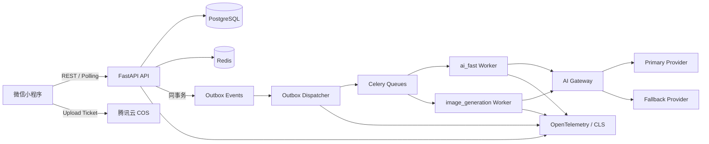
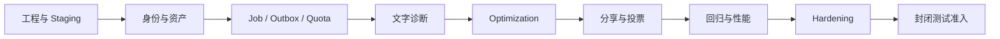

# AI Wardrobe MVP 实现方案与任务进度明细 V1.0

- 文档状态：实施中
- 基线日期：2026-07-26
- 计划启动：2026-07-27
- 计划完成：2026-09-04
- 封闭测试启动目标：2026-09-07

## 一、MVP 定义

本项目 MVP 定义为：

```text
P0a Infrastructure Foundation
+ P0b AI Experience
+ P0 Hardening
+ 30～50 人封闭测试准入
```

MVP 需要验证的核心假设：

1. 用户上传一张现实穿搭照片后，能够快速获得可信、可执行的穿搭诊断。
2. Minimal Change Before/After 比完全重做更可信，更容易形成分享。
3. 用户在获得 Wow Moment 后，愿意继续进入后续的真实衣橱建库阶段。

MVP 核心用户旅程：

```text
微信登录与授权
→ 上传穿搭照片
→ 选择场景
→ 创建 AI 诊断任务
→ 先获得文字诊断
→ 查看评分、优点、Primary Issue
→ 请求 Minimal Change Optimization
→ 获得 Before/After
→ 查看“具体改了什么”
→ 微信分享
→ 好友查看并参与 A/B 投票
→ 引导用户进入后续建库候补
```

MVP 发布结果不是“功能 Demo”，而是一个可供 30～50 名真实用户使用、可追踪、可恢复、可控成本、可执行删除请求的封闭测试版本。

## 二、范围边界

### 2.1 MVP 必须包含

- 微信小程序基础壳、登录、用户授权和内部用户身份。
- 用户隐私告知、图片处理授权和账号删除入口。
- COS Upload Ticket、图片直传、服务端校验和私有资产访问。
- AI Gateway、Provider Adapter、Fallback、超时、重试和成本记录。
- GenerationJob、AIInvocation、Celery、Transactional Outbox。
- Job 状态轮询、页面退出恢复、失败提示和免费额度释放。
- AI 穿搭诊断：评分、优点、问题、Primary Issue、优化计划。
- Minimal Change Optimization：最多替换两件，优先调整穿法或替换一件。
- Optimization Critic、异常结果拦截和失败降级。
- Before/After 展示和修改说明。
- 微信分享、SceneCode、来源归因和 A/B Vote。
- Rate Limiting、免费 Quota、日志、Trace、指标和告警。
- Golden Dataset、AI 回归、人工评审和模型灰度能力。
- Staging、CI/CD、数据库备份与恢复演练。
- 关键路径 Unit、Integration、Contract、E2E、Performance、Security、Privacy 测试。

### 2.2 MVP 明确不包含

- Universal Wardrobe Ingestion。
- 商品链接解析、截图降级和 Product Snapshot。
- WardrobeItem、Garment Digital Twin 和 Entity Resolution。
- Display Asset、Visual Shoe Wall、Scene Snapshot 衣橱。
- Outfit Agent、Look、WearEvent、PreferenceSignal。
- 完整 Admin 管理后台。
- 完整离线衣橱。
- 付费 Credits 购买和 `credit_ledger` 商业账本。
- Wardrobe-aware Commerce、Purchase Intelligence 和 Try-On。
- 微服务、Neo4j、复杂 LangGraph Agent、3D 或尺码预测。

完整 Admin 不进入 MVP。封闭测试期间优先使用受控运维脚本、云控制台和只读查询；如果实际运营需要管理页面，应单独评审其范围和权限。

### 2.3 MVP 数据范围

P0 需要落地或预留的核心数据：

- `users`
- `user_identities`
- `user_profiles`
- `user_assets`
- `source_photos`
- `style_diagnoses`
- `style_optimization_results`
- `generation_jobs`
- `ai_invocations`
- `outbox_events`
- `share_records`
- Vote 与来源归因记录
- `quota_policies`
- `usage_counters`
- `quota_reservations`（Reserve/Commit/Release 幂等账本）
- `deletion_jobs`

MVP 使用免费 Quota 的 Reserve/Commit/Release 语义保证失败不扣次数；付费 `credit_ledger` 推迟到 P1 或商业化阶段。

## 三、计划假设与资源配置

### 3.1 时间假设

- 2026-07-27 启动。
- 每周 5 个工作日。
- 总工期 6 周，共 30 个工作日。
- 前两周完成 P0a。
- 第 3～5 周完成 P0b。
- 第 6 周完成 Hardening 和封闭测试准入。
- 如果实际启动日期变化，计划按工作日整体顺延。

### 3.2 建议团队

| 角色 | 建议投入 | 核心责任 |
|:---|:---:|:---|
| 产品负责人 / UX | 0.5 人 | 范围冻结、流程、验收、测试招募 |
| 小程序前端 | 1 人 | 小程序页面、状态恢复、弱网、分享 |
| 后端 | 1～2 人 | API、数据、资产、Job、Outbox、权限 |
| AI 工程 | 1 人 | Gateway、Prompt、Schema、Critic、Eval |
| QA | 0.5～1 人 | 测试计划、回归、E2E、发布验收 |
| DevOps | 0.5 人 | 环境、CI/CD、监控、备份、发布 |
| 视觉设计 | 0.25～0.5 人 | 诊断结果、Before/After、分享卡片 |

基线计划按约 4.5～5 个全时当量设计。如果只有 2～3 名工程人员，建议将工期调整为 8～10 周，不应通过删除测试、隐私或可靠性工作压缩到 6 周。

### 3.3 工作节奏

- 每日：15 分钟站会，只同步完成、下一步和阻塞。
- 每周一：确认周目标和任务 Owner。
- 每周三：风险与 AI Bad Case Review。
- 每周五：可运行 Demo、质量数据、成本数据和进度复盘。
- 每个 Phase 结束：Release Gate Review。
- Hardening 期间：每日 Bug Triage，Blocker 当日定 Owner。

任务状态统一为：

```text
NOT_STARTED → IN_PROGRESS → IN_REVIEW → DONE
                            ↘ BLOCKED
```

只有满足任务验收条件并提供证据后才能标记为 `DONE`。

## 四、目标技术实现

### 4.1 运行架构



### 4.2 MVP 模块

```text
app/
├── identity/        # 微信登录、内部用户
├── assets/          # Upload Ticket、Asset Registry、删除
├── diagnosis/       # 诊断与优化业务
├── growth/          # 分享、归因、投票
├── governance/      # Quota、删除、合规
├── ai/              # Gateway、Provider、Prompt、Schema
├── jobs/            # Job、Invocation、状态机
├── events/          # Outbox、Dispatcher、事件
├── infrastructure/  # DB、Redis、COS、Telemetry
└── shared/          # 严格控制的通用类型
```

每个模块遵循：

```text
Public Application Service → Domain → Infrastructure
```

### 4.3 MVP API 契约

身份：

- `POST /api/v1/auth/wechat/login`
- `GET /api/v1/me`
- `PATCH /api/v1/me/profile`

资产：

- `POST /api/v1/assets/upload-ticket`
- `POST /api/v1/assets/{id}/complete`
- `DELETE /api/v1/assets/{id}`

诊断与优化：

- `POST /api/v1/style-diagnoses`
- `GET /api/v1/style-diagnoses/{id}`
- `POST /api/v1/style-diagnoses/{id}/optimizations`
- `GET /api/v1/style-optimizations/{id}`

任务：

- `GET /api/v1/jobs/{jobId}`

分享与投票：

- `POST /api/v1/shares`
- `GET /api/v1/shares/{sceneCode}`
- `POST /api/v1/votes`
- `GET /api/v1/votes/{targetId}/result`

隐私：

- `POST /api/v1/me/deletion-request`
- `GET /api/v1/me/deletion-status`
- `DELETE /api/v1/me/photos/{id}`

### 4.4 异步执行

MVP 启用队列：

- `ai_fast`：文字诊断与 Critic。
- `image_generation`：Optimization 图片生成或编辑。
- `background`：分享资产派生、清理和非紧急任务。
- `governance`：DeletionJob。

关键流程：

```text
API 创建业务记录与 OutboxEvent
→ 同事务提交
→ Dispatcher 发布 Celery Task
→ Worker 创建 AIInvocation
→ AI Gateway 调用 Provider
→ Schema / Quality Validation
→ 更新结果与 Job
→ Quota Commit 或 Release
```

### 4.5 前端页面

- 登录与授权页。
- 今日页 / 上传入口。
- 场景选择页。
- 上传进度和弱网重试页。
- Job 进度页。
- 诊断结果页。
- Optimization 等待页。
- Before/After 对比页。
- 分享确认页。
- 好友分享落地页。
- A/B Vote 页。
- 任务中心。
- 隐私和删除请求页。
- 通用错误、空状态、超时和降级状态。

## 五、六周里程碑计划

### 5.1 总体进度目标

| 周次 | 日期 | 阶段 | 周末目标 | 累计计划进度 |
|:---|:---|:---|:---|---:|
| W1 | 07-27～07-31 | P0a | 工程骨架、环境、CI、数据基线可运行 | 15% |
| W2 | 08-03～08-07 | P0a | 登录、上传、Job、Outbox 全链路通过 | 35% |
| W3 | 08-10～08-14 | P0b | 文字诊断垂直切片可演示 | 55% |
| W4 | 08-17～08-21 | P0b | Optimization 与 Before/After 可演示 | 75% |
| W5 | 08-24～08-28 | P0b | 分享、投票、质量回归和性能基线完成 | 88% |
| W6 | 08-31～09-04 | Hardening | Release Gate 通过，具备封闭测试准入条件 | 100% |

累计进度按加权任务计算，不按完成任务数量简单平均。

### 5.2 W1：工程与契约基线

目标：

- Backend、小程序和基础设施骨架可运行。
- Staging、PostgreSQL、Redis、COS 和 CI 连通。
- OpenAPI、数据库 Migration 和模块边界建立。
- AI Eval 轨同时启动。

周末交付：

- 本地一键启动说明。
- Staging 健康检查。
- 第一版数据库 Migration。
- CI 执行格式化、静态检查、单元测试和构建。
- TraceID 可贯穿 API 日志。
- Diagnosis Structured Output Schema V0。
- Golden Dataset 样本选择规范。

退出条件：

- 主分支构建通过。
- Staging API 可访问。
- Migration 可以在空库完整执行。
- COS、Redis、PostgreSQL 连接不依赖开发者本机状态。

### 5.3 W2：P0a 端到端基础能力

目标：

- 微信登录、私有图片上传、Job、Outbox、Quota 形成完整基础链路。

周末交付：

- 微信登录和 Internal User ID。
- Upload Ticket → COS → Complete → Asset Registry。
- MIME、Magic Number、Dimensions 校验。
- GenerationJob 和 AIInvocation。
- Outbox Dispatcher 和 Celery Worker。
- Job Polling、`pendingJobs` 恢复和统一失败 UX。
- Redis Token Bucket 限流。
- Quota Reserve/Commit/Release。
- Ownership Guard 与跨用户隔离测试。

退出条件：

- M0 核心链路在 Staging 可用。
- 重复请求不会创建重复高成本任务。
- Worker 或 Dispatcher 重启后任务不会丢失。
- Job 失败不会扣除免费额度。

### 5.4 W3：文字诊断垂直切片

目标：

- 用户可以完成“上传 → 场景 → 文字诊断 → 结果展示”。

周末交付：

- Diagnosis 创建和查询 API。
- AI Gateway Primary/Fallback。
- Prompt、Model、Schema Version 持久化。
- 结构化结果：score、strengths、issues、primary_issue、optimization_plan。
- 文字诊断渐进展示。
- 任务超时、输入不合格和 Provider 失败 UX。
- 50+ 张 Style Diagnosis Golden Dataset 初版。
- Diagnosis Success Rate 和延迟基线。

退出条件：

- Staging 可完整演示。
- Structured Output Schema Validation 通过。
- Diagnosis Success Rate ≥95%，或已形成可验证的缺口修复计划。
- P95 延迟已采集并可以按 Provider/Model 分解。

### 5.5 W4：Minimal Change Optimization

目标：

- 用户可以从诊断结果请求优化并获得可信 Before/After。

周末交付：

- Change Budget Level 1～3。
- Optimization Plan 和 Image Edit 调用。
- Critic 检查身份、服装保真、最小改动和视觉异常。
- OptimizationResult 持久化。
- Before/After UI 和“只改了什么”说明。
- 图片失败、Critic 不通过和超时降级。
- Optimization Fidelity 测试集和人工评审表。

退出条件：

- Optimization 图片 P90 基线已采集。
- Critic First-pass ≥75% Release Gate。
- 失败结果不会错误地标记为成功或扣除额度。
- Before/After 中未修改区域的意外变化进入质量拦截。

### 5.6 W5：Growth Loop 与全面验证

目标：

- 分享和 A/B Vote 闭环可用，完成发布前主要质量与性能验证。

周末交付：

- Share Asset 与 Private Asset 分离。
- SceneCode、来源归因和分享落地页。
- A/B Vote API、去重规则和结果展示。
- 分享链路性能测试。
- 核心 API Contract 和 E2E。
- 并发 Diagnosis、图片队列和 Provider 故障测试。
- AI Regression 与 20 例/维度人工抽样。
- Cost per Diagnosis 和 Cost per Optimization 基线。
- 监控面板与关键告警。

退出条件：

- M1、M2 功能完整。
- 分享到好友可见的目标延迟 ≤3 秒。
- 来源可归因，投票不可因简单重复请求重复计数。
- 模型或 Prompt 相比基线无显著退化。

### 5.7 W6：Hardening 与封闭测试准入

目标：

- 完成 Bug 清理、恢复演练、灰度演练和封闭测试发布。

周末交付：

- P0 Blocker Bug 清零。
- Prompt、Model 和 Schema Version 化确认。
- Migration Review。
- Rate Limit、Quota、告警和 Dashboard 验收。
- 数据库备份恢复演练报告。
- 删除任务和隐私清理验证。
- Canary、暂停和回滚演练。
- 30～50 人测试名单、反馈渠道和使用说明。
- 发布说明、已知问题和 On-call 安排。

退出条件：

- M0、M1、M2 和 Hardening Gate 全部通过。
- Staging E2E 通过。
- 数据丢失为 0。
- 核心路径无 Blocker。
- 负责人签署 Go 决策后才能开放封闭测试。

## 六、详细 WBS 与任务进度明细

代码实现已启动。以下状态以验证证据为准；Owner 当前仍填写建议角色，进入团队协作时必须落实到具体人员。

当前实施快照（2026-07-27）：

- 当前阶段：P0b / W6，隐私删除、孤儿上传清理、依赖感知就绪探针与可观测性已通过本地实库和容器验证；Staging、真实 COS/微信/OpenAI、质量数据与真机验收仍待补齐。
- `DONE`：20 项。
- `IN_REVIEW`：46 项。
- `IN_PROGRESS`：8 项。
- `BLOCKED`：5 项，尚未提供 Staging/COS/微信应用凭据和 50+ 张可用于诊断与优化
  研发评估的授权照片，无法执行真实全链路与质量基线。
- `NOT_STARTED`：1 项。
- 已验证：后端 Ruff、严格 Mypy（源码/测试/脚本共 155 个文件）、246
  个 PostgreSQL/Redis 实际执行测试、十版 Alembic 空库升级/回滚/模型漂移与离线 SQL、
  Python 生产依赖 0 个已知漏洞；
  小程序 ESLint、类型检查、46 个测试、微信构建与 High 依赖漏洞门禁。
  其中 24 个 PostgreSQL/Redis 集成测试已纳入 CI。
- Docker 证据：独立 Compose 项目使用全新卷连续启动两次均健康；空库迁移和 23 个集成
  测试在 Compose 服务上通过；生产镜像以 UID/GID 10001 在只读根文件系统启动，内置
  Liveness 与 PostgreSQL/Redis Readiness 均通过。
- 远端 CI 证据：GitHub Actions
  [CI #14](https://github.com/Fu0000/ai-wardrobe/actions/runs/30247845974) 在
  `develop@613a86a` 上完成，Backend 与 Miniapp Job 均为 `success`。
- W3 代码证据：8 场景选择、诊断创建/查询、幂等键弱网保留、Quota
  Reserve/Commit/Release、OpenAI Responses Structured Output、主备模型、
  AIInvocation、四类 Worker 共用的带令牌执行租约骨架、退避轮询、任务恢复、
  输入质量失败和诊断结果页。
- W3 待验收：真实 PostgreSQL/Redis/Celery/COS/OpenAI 全链路、微信低端安卓真机、50+ 授权样本 Eval 和 P90/P95/成本基线。
- W4 代码证据：Change Budget Level 1～3、Optimization API、GPT Image Edit、保比例输出尺寸、双次有界生成、结构化 Critic、六类保持约束、失败释放额度、Before/After 滑杆、任务恢复，以及 Fidelity Eval/Rubric。
- W4 待验收：真实 COS/OpenAI 图片编辑与 Critic 联调、50+ 授权 Before/After 样本、双人盲评、Critic First-pass、P90 和单位成本基线、微信真机保存图片。
- W5 Growth 代码证据：独立 Share Derivative、EXIF 清理、AI 编辑标识、分享确认页、
  SceneCode、好友落地页与二次转发、好友/朋友圈渠道链接、HMAC 防重复投票、可改票
  不重复计数、好友侧任务信息隔离，以及 Share Invoked/Open/Vote/Continue 去重归因事件。
- W5 Growth 待验收：真实 COS 分享卡片、微信好友分享和打开、分享可见 P90、投票并发、低端安卓真机，以及归因漏斗查询。
- W6 Privacy/Hardening 代码证据：账号与单图异步 DeletionJob、原图到诊断/优化/分享派生图的闭包清理、COS/DB 两阶段重试、删除竞态稳定检查、账号删除后的本地已保存照片和业务状态清理、依赖感知 Readiness、1 MiB JSON Body Limit、CORS 与安全响应头。
- W6 Observability 代码证据：API → Outbox → Celery → AI Provider Trace 传播、`X-Trace-ID`/结构化日志关联、HTTP/Worker/AI/Outbox/Product 指标、业务终态失败计数、Pending Age/Failed Count，以及预置 Collector、Prometheus、Grafana Dashboard、Alertmanager 和七条告警规则。
- W6 Release 代码证据：非 Root/只读文件系统生产镜像、不可变 SHA Staging 部署、前向 Migration Job、分队列 Worker、Readiness Rollout Gate、provenance/SBOM，以及默认执行数据清理的授权样本全链路冒烟脚本。
- W6 Security/CI 代码证据：应用层显式 Trusted Proxy CIDR、从右向左解析
  `X-Forwarded-For`、容器关闭 Uvicorn 全局 Proxy Header 信任、生产环境拒绝
  全地址段、已知本地默认密钥和非 HTTPS 外部 Provider，并预校验 Fernet Key
  与关键凭据 TTL；CI 对一次性 PostgreSQL 实际升级与模型漂移、Redis Token
  Bucket 并发原子性、Asset/Job/Diagnosis/Optimization/Share 跨用户隔离及
  污染关联安全降级、删除闭包、COS 签名方法与 TTL 执行验证；结构化日志
  统一清除 Token、身份标识、私有对象引用、带查询 URL 和图片 Data URL；
  Python/小程序依赖漏洞执行强制门禁；全部第三方
  GitHub Actions 固定完整 Commit SHA，并由 Dependabot 周期更新。
- W6 QA/治理证据：Bug 分级、34 项核心验收用例、三类微信真机矩阵、Release Gate、Go/No-Go 决策规则、发布观察和回滚清单已形成独立可签署文档。
- W6 Recovery/Canary 代码证据：基于 libpq Service 的校验和逻辑备份、隔离空库单事务恢复、RPO/RTO/行数/关系不变量报告；AI 用户稳定分桶、创建时 Policy Snapshot、Worker 按快照执行、0/10/50/100% Staging 审批工作流和回滚阈值 Runbook。
- W6 Performance 代码证据：k6 2.1 API 读流量阶梯、真实 AI 成本/授权数据双重确认、每授权 Asset 单次 Diagnosis 并发与终态轮询、成功率/P90/P95/5xx 阈值、停止条件和标准报告模板。
- W6 Beta Feedback 代码证据：反馈分类/评分/正文、可选且受 Ownership 校验的关联 Job、
  Trace/页面/设备最小化上下文、幂等防重、版本化游标与用户隔离分页、诊断结果直达
  反馈入口、账号删除级联清理、小程序弱网草稿和隐私说明；实际 30～50 人名单与同意
  仍待产品侧落实。
- W6 Beta Operations 证据：Wave 0～3 分批放量、测试者知情准入、每日观测、Bug 分诊、On-call RACI、事件响应、硬停止条件和用户通知模板已落地；具体名单、联系人、版本记录与实际发布待填写。
- W6 待验收：真实 COS 删除与 PostgreSQL 事务回归、OTLP Collector/Dashboard/告警路由、备份恢复、Canary/回滚、性能与安全测试、微信真机，以及 Go/No-Go 签署。

### 6.1 产品、设计与项目治理

| ID | 任务 | Owner | 工期 | 计划 | 依赖 | 完成条件 | 状态 |
|:---|:---|:---|---:|:---|:---|:---|:---|
| PM-01 | 冻结 MVP 范围和非目标 | 产品 | 0.5d | W1 | - | 范围、用户旅程、非目标获批准 | DONE |
| PM-02 | 输出核心页面流程和错误状态 | 产品/设计 | 2d | W1 | PM-01 | 正常、弱网、失败、超时、恢复流程齐全 | DONE |
| PM-03 | 定义埋点和业务指标 | 产品/后端 | 1d | W1 | PM-01 | Diagnosis、Optimization、Share、Vote 可追踪 | DONE |
| PM-04 | 建立验收用例和 Bug 分级 | 产品/QA | 1d | W2 | PM-02 | Blocker/Critical/Major/Minor 定义明确 | DONE |
| PM-05 | 准备封闭测试招募与反馈机制 | 产品 | 2d | W5～W6 | PM-01 | 30～50 人名单、同意、反馈入口准备完成 | IN_PROGRESS |

### 6.2 工程基础与环境

| ID | 任务 | Owner | 工期 | 计划 | 依赖 | 完成条件 | 状态 |
|:---|:---|:---|---:|:---|:---|:---|:---|
| ENG-01 | 建立 Backend 模块骨架 | 后端 | 1.5d | W1 | PM-01 | 模块与三层边界落地，健康检查可用 | DONE |
| ENG-02 | 建立小程序工程骨架 | 前端 | 1.5d | W1 | PM-02 | Vue 3、TS strict、Pinia、基础路由可运行 | DONE |
| ENG-03 | 建立配置与 Secret 管理 | 后端/DevOps | 1d | W1 | ENG-01 | 本地、Staging、Production 配置隔离 | DONE |
| INF-01 | 本地 Docker 开发环境 | DevOps/后端 | 1.5d | W1 | ENG-01 | PostgreSQL、Redis 可重复启动 | DONE |
| INF-02 | Staging 云资源和网络 | DevOps | 2d | W1 | ENG-03 | API、DB、Redis、COS 连通且最小权限 | NOT_STARTED |
| INF-03 | CI Pipeline | DevOps | 1.5d | W1 | ENG-01、ENG-02 | PR 自动执行 Test、Lint、Type Check、Build | DONE |
| INF-04 | OpenTelemetry、TraceID 和 CLS | DevOps/后端 | 2d | W1～W2 | INF-02 | API、Worker、Dispatcher 可按 TraceID 查询 | IN_REVIEW |
| INF-05 | Staging 自动部署 | DevOps | 1.5d | W2 | INF-02、INF-03 | 主分支构建可部署到 Staging | IN_REVIEW |

### 6.3 数据库、身份与权限

| ID | 任务 | Owner | 工期 | 计划 | 依赖 | 完成条件 | 状态 |
|:---|:---|:---|---:|:---|:---|:---|:---|
| DB-01 | P0 数据模型和首版 Migration | 后端 | 2d | W1 | ENG-01 | 空库升级成功，表、索引、约束可审查 | IN_REVIEW |
| DB-02 | Migration CI 与前向策略 | 后端/DevOps | 1d | W1 | DB-01、INF-03 | CI 验证升级，禁止生产手工改表 | IN_REVIEW |
| AUTH-01 | 微信登录 Code Exchange | 后端/前端 | 2d | W2 | INF-02、ENG-02 | 登录成功、失败和过期处理完整 | IN_REVIEW |
| AUTH-02 | Internal User ID 与 Identity 映射 | 后端 | 1d | W2 | DB-01、AUTH-01 | 微信身份与内部用户解耦 | IN_REVIEW |
| AUTH-03 | `GET/PATCH /me` 与资料页 | 后端/前端 | 1.5d | W2 | AUTH-02 | 用户资料可读写并校验 Schema | DONE |
| SEC-01 | Scoped Repository 与 OwnershipGuard | 后端 | 2d | W2 | DB-01、AUTH-02 | 所有 MVP 用户资源端点双层校验 | IN_REVIEW |
| SEC-02 | 跨用户隔离测试 | QA/后端 | 1d | W2、W5 | SEC-01 | 资产、诊断、优化、分享私有资源不可越权 | IN_REVIEW |

### 6.4 资产与上传

| ID | 任务 | Owner | 工期 | 计划 | 依赖 | 完成条件 | 状态 |
|:---|:---|:---|---:|:---|:---|:---|:---|
| AST-01 | COS Bucket、CORS 与最小权限 | DevOps | 1d | W1 | INF-02 | 私有 Bucket，上传和读取权限分离 | BLOCKED |
| AST-02 | Upload Ticket API | 后端 | 1.5d | W2 | AST-01、AUTH-02 | 文件大小、类型、用户范围进入 Ticket | IN_REVIEW |
| AST-03 | 小程序 COS 直传与草稿 | 前端 | 2d | W2 | AST-02 | 上传、进度、中断、重试可用 | IN_REVIEW |
| AST-04 | Asset Complete 与 Registry | 后端 | 1.5d | W2 | AST-02、DB-01 | COS 对象与业务 Asset 正确绑定 | IN_REVIEW |
| AST-05 | MIME、Magic Number、Dimensions 校验 | 后端 | 1.5d | W2 | AST-04 | 伪造扩展名、超大图、异常尺寸被拒绝 | DONE |
| AST-06 | Signed URL 和私有访问 | 后端 | 1d | W2 | AST-04、SEC-01 | URL 可过期，不能跨用户获取 | IN_REVIEW |
| AST-07 | 图片删除和孤儿资产处理 | 后端 | 1.5d | W5 | AST-04 | DB 与 COS 清理可重试、可观测 | DONE |

### 6.5 Job、Outbox、Quota 与限流

| ID | 任务 | Owner | 工期 | 计划 | 依赖 | 完成条件 | 状态 |
|:---|:---|:---|---:|:---|:---|:---|:---|
| JOB-01 | GenerationJob 状态机 | 后端 | 2d | W1～W2 | DB-01 | 状态迁移受控并有单元测试 | DONE |
| JOB-02 | AIInvocation 与成本字段 | 后端/AI | 1.5d | W2 | DB-01、JOB-01 | 每次真实 Provider 调用均可核算 | IN_REVIEW |
| JOB-03 | Celery 队列和 Worker | 后端/DevOps | 2d | W2 | INF-01、INF-02 | `ai_fast`、`image_generation` 可独立运行 | IN_PROGRESS |
| EVT-01 | Transactional Outbox 表和写入 | 后端 | 1.5d | W2 | DB-01 | 业务数据与事件同事务 | IN_REVIEW |
| EVT-02 | Dispatcher 与安全竞争 | 后端 | 2d | W2 | EVT-01、JOB-03 | `SKIP LOCKED`、重试、状态和错误记录完整 | IN_REVIEW |
| EVT-03 | Outbox 兜底扫描和监控 | 后端/DevOps | 1d | W2 | EVT-02、INF-04 | Pending Age、Failed Count 可告警 | IN_REVIEW |
| JOB-04 | Idempotency-Key 框架 | 后端 | 2d | W2 | JOB-01 | 重复创建不重复消费资源 | IN_REVIEW |
| JOB-05 | Job 查询、错误映射和恢复 | 后端/前端 | 2d | W2 | JOB-01、ENG-02 | `pendingJobs` 可恢复，内部错误不外泄 | IN_REVIEW |
| QTA-01 | 免费 Quota Policy 和 Counter | 后端 | 1.5d | W2 | DB-01、AUTH-02 | 支持按日/月配置限额 | IN_REVIEW |
| QTA-02 | Reserve/Commit/Release | 后端 | 1.5d | W2 | QTA-01、JOB-01 | 并发安全，失败不扣次数 | IN_REVIEW |
| RATE-01 | Redis Token Bucket | 后端 | 1.5d | W2 | INF-01、AUTH-02 | 429、Retry-After 和三层限流可验证 | IN_REVIEW |

### 6.6 AI Gateway 与评估基础

| ID | 任务 | Owner | 工期 | 计划 | 依赖 | 完成条件 | 状态 |
|:---|:---|:---|---:|:---|:---|:---|:---|
| AI-01 | AI Gateway 接口和 Provider Adapter | AI/后端 | 2d | W1～W2 | ENG-01 | 业务代码不直接依赖具体 Provider | DONE |
| AI-02 | Task Policy 与 Fallback | AI | 1.5d | W2 | AI-01 | Primary、Fallback、Timeout、Retry、Cost Ceiling 可配置 | IN_REVIEW |
| AI-03 | Prompt/Model/Schema Registry | AI/后端 | 1.5d | W2 | AI-01、DB-01 | 所有结果可追溯到三个版本 | IN_REVIEW |
| AI-04 | Untrusted Visual Content 防护 | AI/后端 | 1d | W3 | AI-01 | 图片文字不能越过 Tool 与权限边界 | DONE |
| EVAL-01 | Golden Dataset 规范与标注表 | AI/产品 | 1.5d | W1 | PM-01 | 场景、体型、光线、Bad Case 覆盖规则明确 | DONE |
| EVAL-02 | 收集和标注 50+ 诊断样本 | AI/产品 | 4d | W1～W3 | EVAL-01 | 样本获授权、脱敏、可重复评估 | BLOCKED |
| EVAL-03 | 自动 Eval Runner | AI | 2d | W2～W3 | AI-03、EVAL-01 | 输出成功率、Schema、质量、延迟、成本 | DONE |
| EVAL-04 | 人工评审 Rubric | 产品/AI/QA | 1d | W3 | EVAL-01 | 每维度 ≥20 例，评分标准一致 | DONE |

### 6.7 AI 诊断

| ID | 任务 | Owner | 工期 | 计划 | 依赖 | 完成条件 | 状态 |
|:---|:---|:---|---:|:---|:---|:---|:---|
| DIA-01 | Diagnosis Structured Schema | AI/后端 | 1d | W2 | AI-03 | 字段、Enum、Unknown Fallback 明确 | DONE |
| DIA-02 | Diagnosis 创建和查询 API | 后端 | 2d | W3 | AST-04、JOB-04、DIA-01 | OpenAPI、幂等、Ownership 测试通过 | IN_REVIEW |
| DIA-03 | 诊断 Worker Pipeline | AI/后端 | 3d | W3 | JOB-03、AI-02、DIA-01 | Job、Invocation、结果和失败状态一致 | IN_REVIEW |
| DIA-04 | 上传、场景和任务进度 UI | 前端 | 3d | W3 | AST-03、JOB-05、PM-02 | 正常、弱网、退出恢复均可演示 | IN_REVIEW |
| DIA-05 | 诊断结果 UI | 前端/设计 | 2d | W3 | DIA-02、PM-02 | 评分、优点、Primary Issue、CTA 清晰 | IN_REVIEW |
| DIA-06 | 诊断失败和输入质量 UX | 前端/后端 | 1.5d | W3 | DIA-03、DIA-04 | 输入问题、临时失败、最终失败区分 | IN_REVIEW |
| DIA-07 | 诊断 Eval、调优与基线 | AI/QA | 3d | W3 | EVAL-02、EVAL-03、DIA-03 | Success、P95、质量和成本报告完成 | BLOCKED |

### 6.8 Minimal Change Optimization

| ID | 任务 | Owner | 工期 | 计划 | 依赖 | 完成条件 | 状态 |
|:---|:---|:---|---:|:---|:---|:---|:---|
| OPT-01 | Change Budget 与 Optimization Plan | AI/产品 | 1.5d | W4 | DIA-07 | Level 1～3 规则可测试 | DONE |
| OPT-02 | Optimization API 和持久化 | 后端 | 2d | W4 | DIA-02、JOB-04 | 幂等、Ownership、Quota 测试通过 | IN_REVIEW |
| OPT-03 | Image Edit Worker | AI/后端 | 3d | W4 | OPT-01、AI-02、JOB-03 | 结果、Invocation、成本和状态完整 | IN_REVIEW |
| OPT-04 | Optimization Critic | AI | 2d | W4 | OPT-03 | 身份、服装、最小改动和异常可评估 | IN_REVIEW |
| OPT-05 | Critic 失败降级与重试 | AI/后端 | 1.5d | W4 | OPT-04 | 重试有上限，最终失败释放额度 | IN_REVIEW |
| OPT-06 | Before/After 与修改说明 UI | 前端/设计 | 3d | W4 | OPT-02、OPT-03 | 对比流畅、变化说明准确、分享入口清晰 | IN_REVIEW |
| OPT-07 | Optimization Fidelity 数据集 | AI/产品 | 2d | W3～W4 | EVAL-01 | 身份、衣物、意外变化样本齐全 | BLOCKED |
| OPT-08 | Optimization Eval 与人工抽样 | AI/QA | 3d | W4～W5 | OPT-04、OPT-07 | Critic Gate、P90、成本报告完成 | BLOCKED |

### 6.9 分享、归因与投票

| ID | 任务 | Owner | 工期 | 计划 | 依赖 | 完成条件 | 状态 |
|:---|:---|:---|---:|:---|:---|:---|:---|
| GRW-01 | Share Asset 派生和合规模板 | 后端/设计 | 2d | W5 | OPT-06、AST-06 | 分享图不暴露私有 URL 或敏感信息 | IN_REVIEW |
| GRW-02 | SceneCode 和来源归因 | 后端 | 1.5d | W5 | GRW-01 | 新用户来源可追踪 | IN_REVIEW |
| GRW-03 | 分享确认和微信分享 | 前端 | 2d | W5 | GRW-01、GRW-02 | 生成到好友可见目标 ≤3 秒 | IN_REVIEW |
| GRW-04 | A/B Vote API 和防重 | 后端 | 1.5d | W5 | GRW-02 | 幂等、限流、防简单重复投票 | IN_REVIEW |
| GRW-05 | 分享落地页和 Vote UI | 前端 | 2d | W5 | GRW-03、GRW-04 | 好友无需访问私有原图即可参与 | IN_REVIEW |
| GRW-06 | Growth 埋点和漏斗验证 | 产品/后端/QA | 1d | W5 | PM-03、GRW-05 | Share、View、Vote、Continue 可归因 | IN_REVIEW |

### 6.10 隐私、运维、测试与发布

| ID | 任务 | Owner | 工期 | 计划 | 依赖 | 完成条件 | 状态 |
|:---|:---|:---|---:|:---|:---|:---|:---|
| GOV-01 | 图片删除 API 和 DeletionJob | 后端 | 2d | W5 | AST-07、JOB-03 | DB、COS、Cache 清理可重试 | IN_REVIEW |
| GOV-02 | 账号删除请求和状态 | 后端/前端 | 2d | W5 | GOV-01、AUTH-02 | 用户可发起、查询并获得结果 | IN_REVIEW |
| OBS-01 | 系统、Job、AI 和产品 Dashboard | DevOps/后端 | 2d | W5 | INF-04、JOB-02、PM-03 | 核心指标可查询和分解 | IN_REVIEW |
| OBS-02 | 关键告警 | DevOps | 1.5d | W5 | OBS-01、EVT-03 | 5xx、DB、Redis、Provider、Queue、Deletion 可告警 | IN_PROGRESS |
| TST-01 | API Contract 和集成测试 | QA/后端 | 3d | W3～W5 | 各 API | 核心契约和事务边界覆盖 | IN_REVIEW |
| TST-02 | 小程序核心 E2E | QA/前端 | 2d | W5 | DIA-05、OPT-06、GRW-05 | 主路径和三类失败路径自动或稳定手测 | IN_REVIEW |
| TST-03 | 性能与容量测试 | QA/后端/DevOps | 2d | W5 | DIA-03、OPT-03、OBS-01 | 并发、队列积压、P95 报告完成 | IN_PROGRESS |
| TST-04 | Security 与 Privacy 测试 | QA/后端 | 2d | W5 | SEC-01、GOV-02 | 越权、URL 过期、删除和 Prompt 边界通过 | IN_REVIEW |
| OPS-01 | 数据库备份与恢复演练 | DevOps/后端 | 1.5d | W6 | INF-02、DB-02 | 恢复报告证明 RPO/RTO 可接受 | IN_PROGRESS |
| OPS-02 | Canary、暂停和模型回滚演练 | DevOps/AI | 1.5d | W6 | OBS-01、AI-03 | 新旧模型切换和在途 Job 行为正确 | IN_PROGRESS |
| REL-01 | Hardening Bug 修复 | 全员 | 4d | W6 | W1～W5 | Blocker=0，Critical 均有 Owner 和 Deadline | IN_PROGRESS |
| REL-02 | 发布 Checklist 与 Go/No-Go | 产品/QA/技术负责人 | 1d | W6 | 全部 Gate | 签署结论和未决风险清单 | IN_REVIEW |
| BETA-01 | 封闭测试发布和 On-call | 产品/DevOps/QA | 1d | W6 | REL-02 | 测试版本、说明、反馈、应急联系人就位 | IN_PROGRESS |

## 七、依赖关系与关键路径

核心关键路径：



可以并行的工作：

- 工程基础轨与 Offline AI Eval 轨从 W1 同时启动。
- 小程序页面骨架可以在 API 完成前使用 OpenAPI Mock。
- Golden Dataset、Prompt 调优与资产/Job 基础设施并行。
- 监控和测试不能等到 W6 才开始，应在对应功能完成时逐步接入。
- 分享视觉设计可以在 Optimization API 完成前准备。

关键依赖不得绕过：

- 未完成 Asset Complete 和 OwnershipGuard，不进入真实图片诊断联调。
- 未完成 Job、Outbox 和失败释放，不开放 Optimization。
- 未完成 Share/Private Asset 分离，不开放分享。
- 未完成 AI Regression 和恢复演练，不进入封闭测试。

## 八、进度计算与汇报

### 8.1 加权进度

| 工作包 | 权重 |
|:---|---:|
| 工程基础、环境、数据 | 15% |
| 身份、资产、安全 | 15% |
| Job、Outbox、Quota | 15% |
| AI 诊断 | 20% |
| Optimization | 20% |
| 分享与投票 | 5% |
| 测试、运维、Hardening | 10% |

任务进度计分：

- `NOT_STARTED`：0%。
- `IN_PROGRESS`：按剩余工作评估，最高计 70%。
- `IN_REVIEW`：90%。
- `DONE`：100%。
- `BLOCKED`：保持进入阻塞前的进度，不得虚增。

项目总进度：

```text
总进度 = Σ（工作包权重 × 工作包内已完成工时 / 工作包计划工时）
```

### 8.2 周报模板

```text
报告日期：
当前阶段：
计划累计进度：
实际累计进度：

本周完成：
- [任务 ID] 交付物与验证证据

下周计划：
- [任务 ID] 目标和 Owner

质量：
- Diagnosis Success / P50 / P90 / P95
- Optimization Success / Critic First-pass
- Regression

成本：
- Cost per Diagnosis
- Cost per Optimization

风险与阻塞：
- 风险、影响、Owner、解除日期

范围变化：
- 新增/删除项、批准人、ADR/文档链接
```

## 九、质量门禁与 Go/No-Go

### 9.1 M0 工程基线

- Staging 全链路可用。
- API、PostgreSQL、Redis、COS、Worker、Dispatcher 和日志可用。
- Rate Limiting 和 Quota 就位。
- 备份恢复演练通过。
- 无跨用户资源访问。

### 9.2 M1 AI Instant Experience

- Diagnosis Success Rate ≥95%。
- Diagnosis P95 <30 秒。
- 目标：P90 <20 秒。
- 数据丢失为 0。
- 失败时展示正确提示并释放额度。
- Critic First-pass Release Gate ≥75%，目标 ≥85%。
- Before/After 明确说明实际修改。

### 9.3 M2 Growth Loop

- SceneCode 可用。
- 来源可归因。
- 好友可以查看并参与 A/B Vote。
- 新用户可继续进入体验。
- 分享生成到好友可见目标 ≤3 秒。

### 9.4 Hardening Gate

- P0 Blocker Bug = 0。
- Critical Bug 均有 Owner 和明确 Deadline。
- Prompt、Model、Schema Version 化。
- Migration Review 完成。
- 核心路径 Integration/E2E 通过。
- 成本基线和预算风险已复盘。
- 日志、Trace、Dashboard 和告警完整。
- Rate Limit 与 Quota 验收通过。
- Backup Restore Drill 完成。
- 隐私删除链路验证通过。

### 9.5 决策规则

- `GO`：所有 Release Gate 通过，允许进入 30～50 人封闭测试。
- `CONDITIONAL GO`：仅剩不影响核心假设和安全性的非关键问题，必须有 Owner 与到期日。
- `NO-GO`：存在数据丢失、越权、隐私删除失败、核心链路 Blocker、额度错误扣除或质量明显退化。

## 十、主要风险与缓冲策略

| 风险 | 触发信号 | 影响 | 预防与缓解 | Owner |
|:---|:---|:---|:---|:---|
| AI Provider 不稳定 | Error Rate、P95 突升 | 诊断或图片失败 | Gateway、Fallback、超时、限流、Canary | AI |
| 图片质量不可信 | Critic First-pass 低 | 用户信任下降 | Minimal Change、Critic、人工抽样、失败不展示 | AI/产品 |
| Job 丢失或卡死 | Pending Age、Queue Backlog | 用户等待无结果 | Outbox、兜底扫描、状态恢复、告警 | 后端/DevOps |
| 微信登录或上传联调延迟 | 真机和 Staging 不一致 | 阻塞主链路 | W1 完成环境，W2 早期真机联调 | 前端/后端 |
| 分享泄露私有资产 | 私有 URL 出现在分享页 | 严重隐私风险 | 独立 Share Asset、过期策略、隐私测试 | 后端/QA |
| 成本超预期 | 单次成本超过 Ceiling | 无法扩大测试 | Quota、路由、低成本诊断、图片重试上限 | AI/产品 |
| 范围膨胀 | P0.5 需求进入 Sprint | 延期 | MVP 非目标清单、变更审批 | 产品 |
| 测试集中到最后 | W5 前无持续回归 | Hardening 失控 | 功能完成即补测试，W3 起每日回归 | QA/技术负责人 |

计划在 W6 保留约 4 个全员工作日作为 Hardening 缓冲，不应提前消耗在非 MVP 功能上。

## 十一、MVP 完成定义

MVP 只有在以下条件全部满足后才算实现完成：

- 30～50 人可通过微信小程序完成完整核心旅程。
- 主路径、弱网恢复、Provider 失败和最终失败均有明确体验。
- 所有高成本任务幂等、异步、可追踪、可恢复。
- 失败任务不会错误消耗用户额度。
- 私有资产、分享资产和用户所有权边界通过测试。
- AI 输出可追溯到 Model、Prompt 和 Schema Version。
- 核心 AI 指标达到 Release Gate。
- 关键 SLO 已通过 Staging 压测和真实设备验证。
- 数据库备份恢复与模型回滚均已演练。
- 发布、监控、告警、反馈和 On-call 流程就位。
- P0 Blocker Bug 为 0。
- 产品、技术与 QA 共同作出 `GO` 决策。

完成 MVP 后，先进行封闭测试与数据复盘，再决定是否进入 P0.5。不得因为 MVP 代码完成而自动启动数字衣橱、商品入库或 Personal Stylist 开发。
