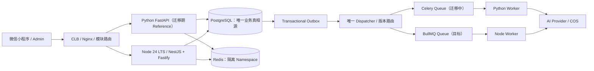
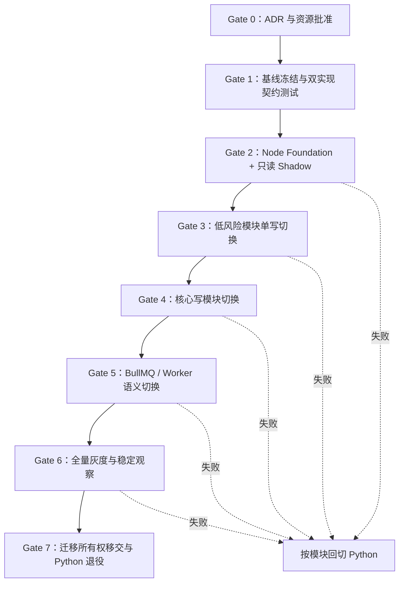

# AI Wardrobe 后端 Node 技术栈迁移评估与任务清单 V1.0

## 0. 文档状态

| 项目 | 内容 |
|:---|:---|
| 状态 | `PROPOSED / NOT APPROVED` |
| 决策性质 | 架构候选方案，不代表已批准变更 |
| 当前生产事实 | Python 3.13 + FastAPI + SQLAlchemy + Celery 仍是唯一有效后端基线 |
| 适用范围 | 后端 API、异步任务、数据访问、AI/媒体、测试、CI/CD、运维与团队交付 |
| 不包含 | 产品范围扩张、微服务化、数据库替换、API v2、业务语义重设计 |
| 生效条件 | 负责人批准且 `docs/08_风险清单与ADR_V1.1.md` 新增正式 ADR 后方可实施 |
| 编制日期 | 2026-07-29 |

本文件回答三个问题：

1. 现有后端能否从 Python 迁移到 Node.js。
2. 迁移会改变什么、不会改变什么，以及主要收益和风险。
3. 如果迁移获批，怎样分阶段完成，确保契约、数据、任务和发布能力不倒退。

---

## 1. 执行摘要

### 1.1 结论

**技术上可以迁移到 Node.js，但不建议在当前 MVP 封闭测试前立即全量重写。**

原因不是 Node.js 能力不足，而是当前后端已经形成一套可验证的业务系统：

- 104 个应用 Python 文件，约 15,858 行应用代码。
- 75 个后端测试文件，约 12,398 行测试代码。
- 376 个后端测试，其中 42 个集成测试。
- 27 个 OpenAPI Operation。
- 18 张 SQLAlchemy 业务表、11 个 Alembic Migration。
- 7 个 Celery Task、4 条业务队列、API + 4 类 Worker + Beat 的运行拓扑。
- 已实现事务 Outbox、幂等、执行租约、失败退款、过期任务回收、PostgreSQL 悲观锁和 `SKIP LOCKED` 等可靠性语义。

因此这不是“FastAPI 换成 NestJS”的框架替换，而是一次**后端重建、可靠性语义复刻和发布证据重建**。在封闭测试前实施，会直接挤占验证用户价值、修复真实问题和收敛 AI 质量的时间。

### 1.2 推荐决策

采用两阶段决策：

1. **当前阶段：保持 Python 基线不变。**先完成 P0 Hardening 和 30～50 人封闭测试，不并行维护第二套后端。
2. **封闭测试后：满足迁移触发条件时，采用绞杀式分模块迁移。**先迁 API 与低风险模块，最后迁异步任务；禁止 Big Bang 切换。

如果迁移获批，推荐目标基线：

| 层 | 候选技术 | 选择理由 |
|:---|:---|:---|
| Runtime | Node.js 24 LTS | 当前生产可用 LTS；不采用仍处于 Current 的 Node.js 26 |
| Language | TypeScript，`strict` 全开 | 与小程序/Admin 统一语言并强化静态边界 |
| Framework | NestJS + Fastify Adapter | 保留模块化、依赖注入、Guard/Pipe/Interceptor；Fastify 提供高性能 HTTP Adapter |
| Contract | Nest DTO + Boundary Validation + OpenAPI Snapshot | 以现有 OpenAPI 为兼容基线，禁止由实现反向静默改契约 |
| PostgreSQL | `pg` + Drizzle ORM + 审核过的 SQL Escape Hatch | 保留 PostgreSQL/pgvector/锁语义；避免 ORM 屏蔽数据库能力 |
| Migration | 迁移期继续由 Alembic 独占；最终再移交 | 禁止 Alembic 与 Node Migration 双重管理同一 Schema |
| Queue | BullMQ + Redis，业务 Job/Outbox 继续落 PostgreSQL | BullMQ 不是 Celery 的直接替换，必须保留幂等、租约、退款和终态语义 |
| Scheduler | BullMQ Job Scheduler 或 K8s CronJob 二选一 | 每个周期任务只有一个调度源 |
| Media | Sharp；无法达到像素/安全等价时保留 Python Worker | 图像处理不能阻塞 Node Event Loop |
| AI | 官方 JavaScript SDK + 现有 AI Gateway/Provider Adapter 契约 | 模型、Prompt、Schema、成本记录保持不变 |
| Storage | 腾讯云 COS Node.js SDK | 能力等价迁移，签名、TTL、Key 规则保持不变 |
| Observability | OpenTelemetry JS + Pino + 现有 OTLP Backend | Trace/Metric 对齐现有名称；日志仍走结构化日志链路 |
| Package Manager | pnpm + Lockfile + Corepack Pin | 依赖安装可复现 |

### 1.3 明确不推荐

- 仅因为“Node 更流行”“前后端同语言”就立即重写。
- Python 与 Node 同时写同一个业务模块或同一类记录。
- Celery Worker 和 BullMQ Worker 竞争消费同一个逻辑任务。
- 迁移期间同时用 Alembic 和 Node Migration Tool 修改同一 Schema。
- 为迁移顺便拆微服务、换数据库、升级 API v2 或调整领域模型。
- 先删 Python 实现，再验证 Node 实现。
- 用单元测试数量代替契约、集成、负载、故障和回滚验证。

---

## 2. 决策边界与成功标准

### 2.1 技术栈可以变化，以下系统事实不能变化

迁移默认只改变实现语言和基础框架。以下内容继续由现有文档定义：

- 产品范围与用户旅程：`docs/01_产品需求文档_PRD_V1.1.md`
- 领域模块与总体架构：`docs/02_技术方案设计_TDD_V1.1.md`
- 数据实体、状态和证据语义：`docs/03_数据架构与数据库设计_DDD_V1.1.md`
- API、错误、幂等和外部集成契约：`docs/04_API与外部集成方案_V1.1.md`
- 测试、发布和恢复要求：`docs/07_测试发布与运维方案_V1.1.md`
- 非功能需求和 SLO：`docs/11_非功能性需求NFR与SLO_V1.0.md`
- MVP 验收门禁：`docs/16_MVP验收与发布清单_V1.0.md`

### 2.2 迁移成功的定义

迁移完成不等于“Node 服务能启动”，而是同时满足：

1. 相同请求在允许差异清单之外具有相同 HTTP 状态、响应结构、错误码和业务副作用。
2. PostgreSQL 数据无丢失、无重复扣费、无重复终态、无越权访问。
3. 任务在重复投递、Worker 崩溃、超时、网络抖动和重启后仍可收敛。
4. 当前 OpenAPI Operation、数据库约束、Outbox 语义、JWT Claims、COS Key 规则保持兼容。
5. 现有 376 项后端测试所表达的行为全部由黑盒契约测试或 Node 测试覆盖。
6. API P95、错误率、可用性、任务积压、AI 成本不劣于现有门禁。
7. 灰度期间可在 15 分钟内按模块回切到 Python，不执行破坏性数据回滚。
8. Python 退出后不存在遗留生产流量、调度器、迁移所有权、告警或隐性运维依赖。

---

## 3. 当前迁移面盘点

以下是 2026-07-29 对仓库的静态盘点，实施前必须由自动化脚本重新生成基线：

| 迁移面 | 当前规模/事实 | 迁移含义 |
|:---|:---|:---|
| 应用代码 | 104 个 Python 文件，约 15,858 行 | 领域、应用、基础设施不能按行翻译，需要按行为重建 |
| 后端测试 | 75 个文件，约 12,398 行，376 项测试 | 需要先提取语言无关的黑盒验收资产 |
| 集成测试 | 42 项 | 必须能对 Python 与 Node 双实现执行 |
| API | 27 个 OpenAPI Operation | 必须做结构差异和行为差异验证 |
| 数据模型 | 18 张表 | 表、列、约束、索引、默认值、时间语义不变 |
| 数据迁移 | 11 个 Alembic Migration | 迁移期只能有一个 Schema Owner |
| 枚举 | 29 个领域/配置枚举 | 值、大小写、未知值行为必须一致 |
| 配置 | 约 85 个 Settings 字段 | 需要建立旧键到新键的显式映射 |
| 异步任务 | 7 个 Celery Task | 重试、幂等、租约、终态和退款均需复刻 |
| 队列 | `ai_fast`、`image_generation`、`media_generation`、`maintenance` | 优先级、并发、超时和隔离策略要保持 |
| 运行拓扑 | API + 4 类 Worker + Beat | Docker、K8s、HPA、PDB、探针、资源限额均受影响 |
| PostgreSQL 专有能力 | `FOR UPDATE`、`SKIP LOCKED`、`ON CONFLICT`、JSONB、pg_trgm、pgvector | ORM 必须允许精确 SQL 与事务控制 |
| 媒体 | Pillow 图片校验/压缩/分享卡渲染 | Sharp 等价性需做 Golden/像素/资源测试 |
| AI | 官方 SDK、结构化输出、图片编辑、Provider Adapter | Prompt/Schema/Model Snapshot 不得因语言迁移改变 |
| 对象存储 | 腾讯云 COS Python SDK | SDK、临时凭证、上传/下载和签名 URL 需要等价实现 |
| 可观测性 | 结构化日志、指标、Trace、业务告警 | 指标名和 Label 必须连续，避免迁移后监控失明 |

### 3.1 最大风险排序

| 优先级 | 风险 | 说明 |
|:---|:---|:---|
| P0 | 异步任务语义退化 | BullMQ 的投递和 Celery 不同，重复执行是必须处理的正常情况 |
| P0 | 数据并发行为改变 | ORM 默认事务、锁、时间和 JSON 映射差异可能破坏业务不变量 |
| P0 | 双写/双调度 | 两套服务同时写或调度会制造重复扣费、重复任务和不可判定状态 |
| P0 | 鉴权/错误契约漂移 | Guard、异常映射和序列化差异可能导致越权或客户端故障 |
| P1 | 图像处理阻塞 Event Loop | CPU/内存密集操作会拖慢所有请求，必须移出 API 主线程 |
| P1 | 测试证据清零 | 直接重写单元测试无法证明跨语言行为等价 |
| P1 | 可观测性断层 | 新旧指标不连续会使灰度判断失真 |
| P2 | 双栈运维成本 | 迁移窗口内需要同时升级、值班和排障两套 Runtime |

---

## 4. 架构选项比较

评分为 1～5 分，5 分最优；加权总分满分 100。评分用于明确当前阶段的取舍，不是永久结论。

| 评价维度 | 权重 | A. 当前保持 Python | B. 立即全量 Node 重写 | C. 封测后分阶段迁移 Node | D. Node API + Python Worker 长期混合 |
|:---|---:|---:|---:|---:|---:|
| MVP 交付与验证速度 | 30% | 5 | 1 | 4 | 3 |
| 当前可靠性与数据风险 | 20% | 5 | 2 | 4 | 3 |
| 前后端语言统一 | 15% | 1 | 5 | 4 | 3 |
| AI/媒体适配 | 15% | 5 | 3 | 3 | 5 |
| 运维简单度 | 10% | 4 | 3 | 3 | 2 |
| 长期 TypeScript 组织收益 | 10% | 2 | 4 | 5 | 4 |
| **加权总分** | **100%** | **80** | **52** | **77** | **66** |

### 4.1 选项 A：当前保持 Python

适合当前 P0/P0 Hardening。优点是保护已经形成的实现、测试和发布证据；缺点是无法获得 TypeScript 人才与前后端复用收益。

### 4.2 选项 B：立即全量 Node 重写

不推荐。风险集中释放，回滚粒度只有整个后端，封闭测试会被技术迁移阻断。

### 4.3 选项 C：封闭测试后分阶段迁移

**若最终决定转 Node，这是推荐方式。**以现有 Python 为 Reference Implementation，通过契约测试、Shadow Read、单模块单写者和流量灰度逐步替换。

### 4.4 选项 D：Node API + Python Worker 长期混合

技术上可行，但会把 Modular Monolith 变成跨语言运行时架构。只有当 AI/媒体计算持续增长、Python 生态优势得到真实数据证明时才值得长期保留；否则它会增加协议、部署、值班和依赖升级成本。

---

## 5. 启动迁移的决策门禁

只有同时满足以下条件，才建议把本文件从候选方案转为实施计划：

- [ ] P0 Hardening 完成，30～50 人封闭测试已产生真实使用数据。
- [ ] 迁移的首要动机被量化，不只是技术偏好。
- [ ] 未来 12 个月后端主要维护者中，至少 2 人长期 TypeScript 能力明显强于 Python。
- [ ] 团队接受 10～14 周日历时间或 93～134 人日的迁移投入。
- [ ] 迁移期间可以暂停同模块的大型产品功能开发。
- [ ] 有一名明确的 Architecture Owner 和一名 Data/Migration Owner。
- [ ] 有 Staging、独立 Redis Namespace、可回放脱敏流量和灰度路由能力。
- [ ] 负责人批准 ADR，明确目标架构、迁移范围、退出条件和回滚责任人。

任一情况成立时，应暂缓迁移：

- 封闭测试尚未证明 MVP 的用户价值。
- 迁移是为了解决一个尚未测量的“性能问题”。
- 无法冻结 API/Schema，或业务团队仍在高频重构同一模块。
- 只有一名工程师同时负责新旧系统和生产值班。
- 不具备模块级路由、双实现契约测试或快速回滚能力。

---

## 6. 目标架构与边界

### 6.1 迁移后的逻辑架构



迁移期间的硬约束：

- 路由按**领域模块**切换，不按随机请求双写。
- 同一模块同一时刻只有一个实现拥有写权限。
- Shadow 只执行无副作用读取，或在完全隔离的数据副本执行。
- 一个逻辑任务只能由 Celery 或 BullMQ 其中一方消费。
- PostgreSQL Job 和 Outbox 仍是任务业务状态与发布意图的真相源。

### 6.2 推荐代码布局

在迁移期新增独立目录，不覆盖现有 `backend/`：

```text
backend-node/
├── src/
│   ├── bootstrap/
│   ├── common/
│   ├── database/
│   ├── observability/
│   ├── worker/
│   └── modules/
│       ├── ai/
│       ├── assets/
│       ├── diagnosis/
│       ├── events/
│       ├── feedback/
│       ├── governance/
│       ├── growth/
│       ├── identity/
│       ├── jobs/
│       └── optimization/
├── test/
│   ├── unit/
│   ├── integration/
│   ├── contract/
│   └── fixtures/
├── package.json
├── pnpm-lock.yaml
├── tsconfig.json
└── Dockerfile
```

模块依赖继续遵守：

```text
Controller / Consumer
        ↓
Public Application Service
        ↓
Domain
        ↓
Repository / Provider Adapter
```

禁止 Controller、Consumer 或其他模块直接操作 Drizzle Table。

### 6.3 Runtime 与 HTTP

- 使用 Node.js 24 LTS；具体 Patch 版本在实施启动日锁定。
- NestJS 负责模块、依赖注入、Guard、Pipe、Interceptor 和生命周期。
- Fastify 作为 HTTP Adapter；所有 Middleware 必须使用 Fastify 兼容实现。
- API 进程只承担 I/O 和轻量序列化；CPU 密集图像任务进入独立 Worker。
- 全局启用 TypeScript `strict`、`noUncheckedIndexedAccess` 和明确的 ESM/CJS 策略。
- 禁止使用隐式 `any`、非空断言掩盖边界数据问题或在 Domain 中依赖 Nest 类型。

### 6.4 API、校验与错误

- 现有 OpenAPI Snapshot 是迁移基线，不以新代码自动生成结果覆盖基线。
- Request DTO 在入口完成类型、格式、枚举、长度和未知字段策略校验。
- Response DTO 在集成测试中验证，禁止 ORM Row 直接序列化出站。
- 统一 Exception Filter 复刻错误 Envelope、错误码、HTTP Status、`request_id`。
- 保持 `Idempotency-Key`、Authorization、Trace Header 和分页语义不变。
- 日期时间统一为 UTC ISO 8601；金额/积分使用整数，不使用 JavaScript 浮点数表达账本金额。

### 6.5 PostgreSQL 与 ORM

推荐 `pg` + Drizzle ORM，并允许在 Repository 内使用经过测试和审查的参数化 SQL。

选择依据：

- 当前系统依赖 PostgreSQL 的事务锁、`SKIP LOCKED`、`ON CONFLICT`、JSONB、pg_trgm 和 pgvector。
- Drizzle 官方提供 pgvector Column 与 HNSW/IVFFlat Index 能力。
- Prisma 官方目前将 `vector` 作为 `Unsupported` 类型，相关操作依赖自定义 Migration 与 Raw SQL；不适合作为本项目默认首选。

数据库硬约束：

- 迁移期不改表名、列名、枚举值、主键类型、外键、唯一约束和索引语义。
- 明确 `timestamp with time zone`、JSONB、UUID、BigInt、Numeric 的 JS 映射。
- 事务函数必须显式传递 Transaction Context，禁止 Repository 悄悄另开连接。
- 对每个 `FOR UPDATE`、`SKIP LOCKED`、`ON CONFLICT` 语句建立并发集成测试。
- 禁止 Alembic 与 Drizzle Kit 同时生成或应用迁移。

### 6.6 异步任务与 Outbox

BullMQ 可作为 Node 目标队列，但不能被视为 Celery 的无语义替换。系统按最坏情况的 At-least-once Delivery 设计：

- 每个任务都有稳定业务幂等键。
- 任务领取使用数据库执行租约和 `execution_token`。
- 完成/失败更新必须带状态与 Token 条件，旧执行者不能覆盖新执行者。
- 重试只包围可重试异常，业务拒绝和 Schema 错误不得盲目重试。
- Credit 遵循 `RESERVE → COMMIT / RELEASE`，终态重复处理不得重复记账。
- Outbox Claim 使用 `FOR UPDATE SKIP LOCKED`，发布成功后才标记。
- Stale Reaper、Orphan Cleanup、Dead-letter/Failed Job 处置均需等价实现。
- Celery Beat 与新 Scheduler 不得同时触发同一周期任务。

迁移路由表建议：

| `task_contract_version` | `executor` | 状态 |
|:---|:---|:---|
| `v1` | `celery-python` | 当前基线 |
| `v2-shadow` | `bullmq-node-isolated` | 只允许隔离验证，不产生正式副作用 |
| `v2` | `bullmq-node` | 通过任务迁移 Gate 后启用 |

### 6.7 AI、图像和对象存储

- AI Gateway、Provider Adapter、Prompt Version、Model Snapshot、结构化 Schema 不变。
- 同一 Golden Case 同时执行 Python/Node Adapter，比较结构字段、错误分类、Token/Cost 记录。
- Sharp 可完成 Metadata、Resize、Composite 等主要能力，但每项必须通过格式、EXIF、Alpha、动画、多页、超大图和损坏文件测试。
- 设置输入字节、像素、通道、页数、解码时间和输出尺寸上限；不得关闭 Sharp 的内存安全限制。
- 图像处理运行在独立 Worker Process/Container；若使用 Worker Thread，必须使用固定大小 Pool。
- 分享卡字体、换行、DPI、色彩空间和透明度建立 Golden Image，不以“肉眼相似”验收。
- 腾讯云 COS 的 Key、MIME、Cache-Control、签名 TTL、临时密钥和私有读策略保持一致。

### 6.8 可观测性

- OpenTelemetry JS 的 Trace 与 Metric 可作为目标能力。
- OpenTelemetry JS Logs 当前仍处于 Development，因此生产日志以 Pino JSON 输出和现有采集链路为主，不把日志迁移绑定到 OTel Logs 稳定性。
- 新旧实现使用相同的 `trace_id`、业务指标名、单位、Label 白名单和告警阈值。
- 增加 `backend_runtime=python|node`、`implementation_version` 低基数标签用于灰度对比。
- 禁止把 `user_id`、`job_id`、URL、Prompt 或错误全文作为 Metric Label。

---

## 7. 分阶段迁移策略



### 阶段 0：决策与冻结

- 批准 ADR、Owner、预算、时间窗和停止条件。
- 冻结 API v1 与 Schema 的非必要破坏性变化。
- 记录 Python 基线性能、错误率、队列延迟和 AI 成本。

### 阶段 1：语言无关的验证资产

- 导出 OpenAPI、Schema Fingerprint、数据库约束、配置清单和指标清单。
- 把关键 Python 测试提升为针对 HTTP/PostgreSQL/Redis 的黑盒测试。
- 建立可同时指向 Python 和 Node 的 Contract Runner。

### 阶段 2：Node Foundation 与只读 Shadow

- 完成 NestJS/Fastify、配置、DB、鉴权、错误、日志、Trace、健康检查。
- Shadow 比较只读 Endpoint；差异写入独立报告，不影响用户响应。
- 任何 Shadow 请求都禁止发送 Outbox、扣费、调用正式 AI 或写 COS。

### 阶段 3：低风险模块切换

建议顺序：

1. Meta/Health。
2. Jobs 查询。
3. Feedback/Events。
4. Identity。
5. Assets。

每个模块独立完成 `0% → 1% → 10% → 50% → 100%`，稳定后再迁下一模块。

### 阶段 4：核心业务写模块切换

建议顺序：

1. Diagnosis。
2. Optimization。
3. Growth/Share。
4. Governance/Delete。

涉及账本、删除闭环和 AI 状态的模块必须完成并发与故障注入后才可灰度。

### 阶段 5：任务执行迁移

- 逐任务启用 BullMQ，不能一次替换全部队列。
- 优先无外部副作用的 Maintenance Task，最后迁 AI/Image/Media。
- 每次只改变一个 `task_contract_version` 的 Executor。
- Python 与 Node 的任务完成率、重试率、重复率、P95/P99、成本并行观察。

### 阶段 6：全量和退役

- Node 100% 后至少稳定观察 14 天。
- 停止 Python 流量、Celery 发布、Beat 调度和 Worker 消费，但先保留可回滚镜像。
- 完成数据库 Migration Owner 移交。
- 30 天无回滚后，才删除 Python 构建、依赖和运行配置。

---

## 8. 详细任务清单

### 8.1 进度快照

| 状态 | 数量 |
|:---|---:|
| `DONE` | 0 |
| `IN_REVIEW` | 0 |
| `IN_PROGRESS` | 0 |
| `BLOCKED` | 0 |
| `NOT_STARTED` | 91 |
| **总计** | **91** |

> 当前方案尚未批准，所有实施任务均为 `NOT_STARTED`。批准后每个任务必须绑定 Owner、PR、证据链接和完成日期。

### 8.2 决策与治理（DEC，8 项）

| ID | 任务 | 完成条件 | 依赖 | 建议 Owner | 状态 |
|:---|:---|:---|:---|:---|:---|
| DEC-01 | 量化迁移动机 | 人才、交付、性能、成本四类指标有现状与目标 | 封测数据 | 架构负责人 | NOT_STARTED |
| DEC-02 | 批准目标选项 | A/C/D 中明确选择，不允许模糊“双栈看看” | DEC-01 | 负责人 | NOT_STARTED |
| DEC-03 | 编写正式 ADR | 范围、技术栈、替代方案、后果、退出条件完整 | DEC-02 | 架构负责人 | NOT_STARTED |
| DEC-04 | 指定模块 Owner | 每个模块有业务/技术 Owner 和 Backup | DEC-02 | 研发负责人 | NOT_STARTED |
| DEC-05 | 指定数据与迁移 Owner | Schema、Migration、数据校验责任唯一 | DEC-02 | 数据负责人 | NOT_STARTED |
| DEC-06 | 批准资源和排期 | 人力、Staging、灰度窗口、冻结窗口获批 | DEC-03 | 项目负责人 | NOT_STARTED |
| DEC-07 | 建立变更台账 | 每项契约允许差异、风险、决策均可追溯 | DEC-03 | 项目负责人 | NOT_STARTED |
| DEC-08 | 定义停止/回退权力 | On-call 可按量化阈值直接停止灰度 | DEC-06 | SRE/负责人 | NOT_STARTED |

### 8.3 基线与清单（BASE，5 项）

| ID | 任务 | 完成条件 | 依赖 | 建议 Owner | 状态 |
|:---|:---|:---|:---|:---|:---|
| BASE-01 | 生成代码与测试基线 | 文件、行数、测试、Operation、Table、Migration 自动导出 | DEC-03 | QA | NOT_STARTED |
| BASE-02 | 冻结 OpenAPI Snapshot | 27 个 Operation 及 Schema 进入版本控制 | DEC-03 | API Owner | NOT_STARTED |
| BASE-03 | 生成数据库 Fingerprint | 表、列、类型、默认值、约束、索引、Extension 可重复对比 | DEC-05 | 数据负责人 | NOT_STARTED |
| BASE-04 | 建立配置映射表 | 所有 Settings 有 Python Key、Node Key、类型、默认值、敏感级别 | DEC-04 | Platform | NOT_STARTED |
| BASE-05 | 记录性能与可靠性基线 | API/Queue/AI/DB 的 P50/P95/P99、错误率和资源基线完整 | DEC-06 | SRE | NOT_STARTED |

### 8.4 Node 基础工程（FND，8 项）

| ID | 任务 | 完成条件 | 依赖 | 建议 Owner | 状态 |
|:---|:---|:---|:---|:---|:---|
| FND-01 | 创建 `backend-node/` | Node 24 LTS、pnpm、NestJS/Fastify、Strict TS 可构建 | DEC-03 | Backend | NOT_STARTED |
| FND-02 | 设计模块边界 | 与现有领域模块一一映射，依赖检查可自动执行 | FND-01 | 架构负责人 | NOT_STARTED |
| FND-03 | 配置加载与校验 | 启动时校验 85 项映射，未知/缺失关键配置 Fail Fast | BASE-04 | Platform | NOT_STARTED |
| FND-04 | 全局错误处理 | Error Envelope、Status、Code、Request ID 与 Python 等价 | BASE-02 | Backend | NOT_STARTED |
| FND-05 | Request Context | Trace、User、Request、Idempotency Context 可跨 Async 调用传递 | FND-01 | Backend | NOT_STARTED |
| FND-06 | Health/Ready/Startup | DB、Redis、配置、Provider 状态符合现有探针语义 | FND-03 | Platform | NOT_STARTED |
| FND-07 | 依赖与供应链门禁 | Lockfile、License、Audit、SBOM、镜像扫描接入 CI | FND-01 | Security | NOT_STARTED |
| FND-08 | 开发规范与模板 | Lint、Format、Test、Module Scaffold、PR Checklist 可执行 | FND-02 | Backend | NOT_STARTED |

### 8.5 契约与安全边界（CTR，7 项）

| ID | 任务 | 完成条件 | 依赖 | 建议 Owner | 状态 |
|:---|:---|:---|:---|:---|:---|
| CTR-01 | DTO 与 Validation 策略 | Null/Optional/Unknown/Enum/Length 行为书面化并测试 | BASE-02 | API Owner | NOT_STARTED |
| CTR-02 | OpenAPI Diff Gate | CI 对 Breaking/Unexpected Diff 失败 | BASE-02,FND-01 | QA | NOT_STARTED |
| CTR-03 | JWT 等价实现 | Algorithm、Claims、Expiry、Clock Skew、错误响应一致 | FND-04 | Security | NOT_STARTED |
| CTR-04 | Authorization Guard | 资源归属和跨用户访问测试全部通过 | CTR-03 | Security | NOT_STARTED |
| CTR-05 | 幂等入口 | Key Scope、Request Hash、冲突和重放响应一致 | FND-05 | Backend | NOT_STARTED |
| CTR-06 | 上传安全边界 | MIME、Magic Bytes、Size、Pixel、Signed URL 与恶意样本验证 | CTR-04 | Security | NOT_STARTED |
| CTR-07 | 外部 Provider 契约 | Timeout、Retry、Circuit、错误分类和审计字段一致 | FND-04 | AI/Platform | NOT_STARTED |

### 8.6 数据访问与迁移（DB，8 项）

| ID | 任务 | 完成条件 | 依赖 | 建议 Owner | 状态 |
|:---|:---|:---|:---|:---|:---|
| DB-01 | 建立 Drizzle Schema | 18 张表只读映射与 Fingerprint 完全一致 | BASE-03,FND-01 | 数据负责人 | NOT_STARTED |
| DB-02 | 类型映射测试 | UUID、Timestamp TZ、JSONB、BigInt、Numeric、Enum 无精度/时区漂移 | DB-01 | Backend | NOT_STARTED |
| DB-03 | 事务上下文 | 嵌套应用服务共享同一事务，Rollback 行为可证 | DB-01 | Backend | NOT_STARTED |
| DB-04 | PostgreSQL 专有 SQL | Lock、Skip Locked、Upsert、Trigram、Vector 均有参数化封装 | DB-01 | 数据负责人 | NOT_STARTED |
| DB-05 | 并发不变量测试 | 扣费、任务领取、Outbox Claim、终态更新在竞争下正确 | DB-03,DB-04 | QA | NOT_STARTED |
| DB-06 | Repository 归属检查 | 禁止跨模块 Table Import/写 Repository，CI 可检测 | FND-02,DB-01 | 架构负责人 | NOT_STARTED |
| DB-07 | Schema Owner 门禁 | 迁移期仅 Alembic 可 Apply；Node CI 只做 Fingerprint Check | DEC-05 | Platform | NOT_STARTED |
| DB-08 | Migration Owner 移交预案 | Baseline、Checksum、Forward-only、Rollback 和应急 Runbook 完整 | DB-07 | 数据负责人 | NOT_STARTED |

### 8.7 业务 API 迁移（API，10 项）

| ID | 任务 | 完成条件 | 依赖 | 建议 Owner | 状态 |
|:---|:---|:---|:---|:---|:---|
| API-01 | Meta/Health | 契约、探针、版本与依赖状态等价 | FND-06,CTR-02 | Platform | NOT_STARTED |
| API-02 | Jobs Query | 列表/详情、归属、状态、时间序列化等价 | DB-02,CTR-04 | Backend | NOT_STARTED |
| API-03 | Feedback | 写入、幂等、Event/Outbox 副作用等价 | DB-05,CTR-05 | Backend | NOT_STARTED |
| API-04 | Events | 埋点校验、去重、隐私字段和批量行为等价 | DB-05,CTR-05 | Backend | NOT_STARTED |
| API-05 | Identity | 微信身份、JWT、Credits、并发初始化等价 | CTR-03,DB-05 | Backend | NOT_STARTED |
| API-06 | Assets | 上传意图、确认、归属、COS Key 和删除行为等价 | CTR-06,DB-05 | Backend | NOT_STARTED |
| API-07 | Diagnosis | Job 创建、Prompt Snapshot、Credit Reserve 和 Outbox 等价 | API-05,API-06 | AI/Backend | NOT_STARTED |
| API-08 | Optimization | 诊断引用、最小变化、任务创建和失败路径等价 | API-07 | AI/Backend | NOT_STARTED |
| API-09 | Growth/Share | 分享卡、访问控制、统计与过期策略等价 | API-08 | Backend | NOT_STARTED |
| API-10 | Governance/Delete | 删除请求、级联、COS 清理、审计和恢复窗口等价 | API-06,DB-05 | Security | NOT_STARTED |

### 8.8 Queue、Worker 与 Outbox（JOB，10 项）

| ID | 任务 | 完成条件 | 依赖 | 建议 Owner | 状态 |
|:---|:---|:---|:---|:---|:---|
| JOB-01 | BullMQ 隔离配置 | Prefix/Redis/权限与 Celery 隔离，不能误消费 | FND-03 | Platform | NOT_STARTED |
| JOB-02 | Task Contract Envelope | Version、Job ID、Idempotency Key、Trace、Attempt Schema 固化 | BASE-02 | Backend | NOT_STARTED |
| JOB-03 | Outbox Dispatcher 路由 | 按 Contract Version 唯一路由，发布/标记原子语义正确 | DB-04,JOB-01 | Backend | NOT_STARTED |
| JOB-04 | 执行租约与 Token | 重复、超时、Worker Lost、旧执行者回写测试通过 | DB-05,JOB-02 | Backend | NOT_STARTED |
| JOB-05 | Retry/Error Taxonomy | 可重试/不可重试/终态异常与 Backoff 对齐 | CTR-07,JOB-04 | Backend | NOT_STARTED |
| JOB-06 | Credit 终态处理 | Commit/Release 恰好一次，重复 Finalize 无副作用 | JOB-04,DB-05 | Backend | NOT_STARTED |
| JOB-07 | 四队列 Worker 拓扑 | 并发、超时、资源、优先级、Shutdown 行为有配置和压测 | JOB-01,JOB-05 | Platform | NOT_STARTED |
| JOB-08 | Scheduler 迁移 | 每个周期任务只有一个调度源，补偿策略明确 | JOB-07 | Platform | NOT_STARTED |
| JOB-09 | Reaper/Cleanup/DLQ | Stale、Orphan、Failed Job 可观测、可重放、可审计 | JOB-04,JOB-08 | Backend | NOT_STARTED |
| JOB-10 | 逐任务 Executor Cutover | 7 个任务逐一完成 Shadow、故障注入、灰度和回切 | JOB-03~09 | SRE/Backend | NOT_STARTED |

### 8.9 AI、媒体与存储（MED，5 项）

| ID | 任务 | 完成条件 | 依赖 | 建议 Owner | 状态 |
|:---|:---|:---|:---|:---|:---|
| MED-01 | AI Provider Adapter | Model/Prompt/Schema/Timeout/Usage/Cost 与 Python Golden 对齐 | CTR-07 | AI Owner | NOT_STARTED |
| MED-02 | COS Adapter | STS、Put/Get/Delete、Signed URL、Header、Key 策略等价 | CTR-06 | Backend | NOT_STARTED |
| MED-03 | Sharp 安全校验 | 格式、损坏、炸弹、EXIF、Alpha、动画、多页、超大图测试通过 | CTR-06 | Media Owner | NOT_STARTED |
| MED-04 | 分享卡渲染 | 字体、换行、DPI、颜色、透明度 Golden Image 达标 | MED-03 | Media Owner | NOT_STARTED |
| MED-05 | CPU/内存隔离 | API Event Loop 无长任务，Worker 限额、超时和 OOM 恢复压测通过 | MED-03,JOB-07 | Platform | NOT_STARTED |

### 8.10 可观测性与运维（OBS，5 项）

| ID | 任务 | 完成条件 | 依赖 | 建议 Owner | 状态 |
|:---|:---|:---|:---|:---|:---|
| OBS-01 | 结构化日志 | 字段、脱敏、Error Cause、Trace 关联与 Python 对齐 | FND-05 | SRE | NOT_STARTED |
| OBS-02 | OpenTelemetry Trace | HTTP/DB/Redis/Queue/Provider Span 连续，采样策略明确 | FND-05 | SRE | NOT_STARTED |
| OBS-03 | Metric 对齐 | 名称、单位、Label、Histogram Bucket 与旧 Dashboard 兼容 | BASE-05 | SRE | NOT_STARTED |
| OBS-04 | Dashboard/Alert 双栈 | Runtime 对比、差异率、队列、Outbox、AI 成本和 SLO 可见 | OBS-02,OBS-03 | SRE | NOT_STARTED |
| OBS-05 | On-call Runbook | 定位、降级、暂停队列、回切、数据核对步骤经演练 | OBS-04 | SRE | NOT_STARTED |

### 8.11 测试与等价证明（TST，8 项）

| ID | 任务 | 完成条件 | 依赖 | 建议 Owner | 状态 |
|:---|:---|:---|:---|:---|:---|
| TST-01 | 双实现 Contract Runner | 同一 Case 可指向 Python/Node 并输出结构化 Diff | BASE-02 | QA | NOT_STARTED |
| TST-02 | 376 项行为映射 | 每项现有测试标记为黑盒覆盖、Node 单测或淘汰并说明原因 | BASE-01 | QA | NOT_STARTED |
| TST-03 | 42 项集成场景双跑 | Python/Node 在隔离数据库中结果一致 | TST-01,DB-05 | QA | NOT_STARTED |
| TST-04 | Shadow Read Diff | 允许差异白名单外差异率为 0 | API-01~10 | QA | NOT_STARTED |
| TST-05 | 并发与故障注入 | DB 竞争、重复投递、Kill Worker、Redis/AI/COS 故障均收敛 | JOB-04~09 | QA/SRE | NOT_STARTED |
| TST-06 | 安全测试 | 越权、JWT、上传、Prompt Injection、Secret/PII 泄漏门禁通过 | CTR-03~07 | Security | NOT_STARTED |
| TST-07 | 性能与容量 | P95≤500ms，且关键路径相对基线退化≤10%，资源无异常增长 | BASE-05,MED-05 | SRE | NOT_STARTED |
| TST-08 | 数据核对工具 | Count、Checksum、Ledger、Job、Outbox、孤儿记录可一键核对 | BASE-03 | 数据负责人 | NOT_STARTED |

### 8.12 构建、部署与灰度（REL，8 项）

| ID | 任务 | 完成条件 | 依赖 | 建议 Owner | 状态 |
|:---|:---|:---|:---|:---|:---|
| REL-01 | Node Dockerfile | Non-root、Multi-stage、固定版本、健康检查、体积与漏洞达标 | FND-07 | Platform | NOT_STARTED |
| REL-02 | 本地 Compose | Python/Node/Worker/DB/Redis 可隔离启动和测试 | REL-01,JOB-01 | Platform | NOT_STARTED |
| REL-03 | CI Pipeline | Lint、Typecheck、Unit、Integration、Contract、OpenAPI、SBOM 全接入 | FND-08,TST-01 | Platform | NOT_STARTED |
| REL-04 | K8s API 工作负载 | Probe、Resource、PDB、HPA、Shutdown、Config/Secret 完整 | REL-01,OBS-02 | Platform | NOT_STARTED |
| REL-05 | K8s Worker 工作负载 | 4 队列隔离、并发、资源、终止宽限和扩缩容正确 | JOB-07,REL-01 | Platform | NOT_STARTED |
| REL-06 | 模块级流量路由 | 可按模块/用户比例切换，回切不发版 | REL-04 | SRE | NOT_STARTED |
| REL-07 | 数据库连接预算 | Python+Node+Worker 峰值连接不超过预算，池参数压测通过 | REL-04,REL-05 | 数据负责人 | NOT_STARTED |
| REL-08 | Staging 发布演练 | 从部署、灰度、故障、回切到核对全链路演练通过 | REL-03~07,OBS-05 | SRE | NOT_STARTED |

### 8.13 切换、观察与退役（CUT，9 项）

| ID | 任务 | 完成条件 | 依赖 | 建议 Owner | 状态 |
|:---|:---|:---|:---|:---|:---|
| CUT-01 | 低风险模块灰度 | 每模块完成 1/10/50/100%，无 Gate 违规 | API-01~06,REL-08 | SRE | NOT_STARTED |
| CUT-02 | 核心模块灰度 | Diagnosis/Optimization/Growth/Governance 逐一完成 | API-07~10,CUT-01 | SRE | NOT_STARTED |
| CUT-03 | Worker 灰度 | 7 个任务逐一切换且可独立回退 | JOB-10,CUT-02 | SRE | NOT_STARTED |
| CUT-04 | 全量稳定观察 | Node 100% 连续 14 天满足 SLO、成本和数据门禁 | CUT-03 | SRE | NOT_STARTED |
| CUT-05 | 停止 Python 写流量 | 路由、权限、连接和审计证明无正式写入 | CUT-04 | SRE | NOT_STARTED |
| CUT-06 | 停止 Celery/Beat | 无待处理任务、无重复调度、回滚镜像仍可用 | CUT-04 | Platform | NOT_STARTED |
| CUT-07 | 移交 Migration Owner | Baseline/Checksum/CI/Runbook 验证后 Node 成为唯一 Owner | DB-08,CUT-05 | 数据负责人 | NOT_STARTED |
| CUT-08 | 清理双栈资产 | 30 天无回滚后删除 Python CI、镜像、Deployment、Secret 和依赖 | CUT-06,CUT-07 | Platform | NOT_STARTED |
| CUT-09 | 文档与复盘收口 | TDD/DDD/API/ADR/WBS/Runbook/成本/经验全部更新 | CUT-08 | 架构负责人 | NOT_STARTED |

---

## 9. 排期与资源估算

这是迁移估算，不是对产品功能的工期承诺。按 2 名 Backend、1 名 Platform/SRE、0.5 名 QA、0.25 名 AI/Media Owner 估算：

| 工作包 | 人日范围 | 关键串行约束 |
|:---|---:|:---|
| 决策、基线与治理 | 6～10 | ADR、Owner、冻结窗口 |
| Node Foundation 与契约 | 11～15 | 配置、鉴权、错误、OpenAPI |
| 数据访问与并发语义 | 8～12 | Transaction/Lock/Outbox |
| 业务 API | 15～22 | 模块单写切换 |
| Queue/Worker/Outbox | 12～18 | 重试、租约、退款、调度 |
| AI/媒体/COS | 5～8 | Golden、CPU/内存隔离 |
| 可观测性与安全 | 7～10 | 指标连续、On-call |
| 测试与等价证明 | 10～15 | 双实现 Contract/Integration |
| 部署、灰度与退役 | 19～24 | 稳定观察期、所有权移交 |
| **总计** | **93～134 人日** | 预计 **10～14 周日历时间** |

建议日历：

| 周期 | 目标 |
|:---|:---|
| 第 1～2 周 | ADR、基线、Node Foundation、Contract Runner |
| 第 3～4 周 | DB/事务/鉴权/可观测性、只读 Shadow |
| 第 5～7 周 | 低风险模块和核心 API 迁移 |
| 第 8～10 周 | Queue/Worker、AI/媒体、故障注入 |
| 第 11～12 周 | Staging、模块灰度、全量切换 |
| 第 13～14 周 | 稳定观察、所有权移交准备；观察期不足则顺延 |

---

## 10. 灰度、回滚与停止条件

### 10.1 每一级灰度的前置条件

- 上一级至少稳定一个完整业务峰谷周期。
- OpenAPI/Contract Diff 无未批准差异。
- Error Rate、P95、DB Pool、Event Loop Lag、Queue Lag、Outbox Age 在阈值内。
- Ledger、Job、Outbox、COS 孤儿核对通过。
- On-call 和回滚责任人在场。

### 10.2 自动停止灰度条件

任一条件成立立即停止放量：

- 5 分钟窗口错误率高于 Python 基线 1 个百分点或超过 SLO。
- 关键 API P95 超过 500ms，或较 Python 基线退化超过 10%。
- 出现跨用户数据访问、重复扣费、无法释放 Credit、错误终态覆盖。
- Outbox `oldest_pending_age`、Queue Lag 或 Failed Job 持续越过现有告警阈值。
- Python/Node 数据核对出现无法解释的不一致。
- AI Schema Invalid Rate、成本或生成失败率越过 Release Gate。
- Node Event Loop Lag、OOM、Crash Loop 或 DB Pool Exhaustion。

### 10.3 回滚步骤

1. 冻结该模块继续放量。
2. 把该模块路由切回 Python。
3. 暂停对应 BullMQ Producer/Worker；不删除 Job。
4. 等待在途执行依据 `execution_token` 收敛或超时。
5. 执行 Ledger/Job/Outbox/COS 数据核对。
6. 保留 Node 日志、Trace、Diff 和输入快照用于复盘。
7. 修复后从 1% 重新开始，禁止跳级。

数据库迁移采用 Expand/Contract 和 Forward-only 策略。灰度窗口内禁止依赖“回滚数据库到旧版本”恢复服务。

---

## 11. 代码、配置和基础设施变更事项

获批后至少需要检查以下资产，任何遗漏都会形成隐性双栈：

| 类别 | 变更事项 |
|:---|:---|
| 仓库根目录 | Workspace、pnpm/Corepack、Node Version、Ignore、Editor、License/Notice |
| Node 应用 | `backend-node/`、配置 Schema、模块、Migration Read Policy、测试 |
| Python 应用 | 迁移期保留 Reference；退役期删除入口、依赖、测试和脚本 |
| 容器 | Node API/Worker Image、Base Image、Non-root、CA/Font/Sharp Runtime |
| Compose | 新 API/Worker、独立 Redis Prefix、Profile、Healthcheck |
| Kubernetes | Deployment、Service、HPA、PDB、ConfigMap、Secret、NetworkPolicy、Cron/Scheduler |
| 数据库 | Connection Pool Budget、Role、Statement Timeout、Migration Owner、Fingerprint |
| Redis | Celery/BullMQ Namespace、ACL、Persistence、Eviction Policy、容量和告警 |
| CI | Typecheck、Lint、Unit、Integration、Contract、OpenAPI Diff、SBOM、Image Scan |
| CD | 模块路由、灰度比例、自动停止、回切、镜像保留 |
| 可观测性 | Dashboard、Alert、Log Parser、Trace Sampling、Runtime Label |
| 安全 | JWT、Secret、COS STS、Dependency Audit、Threat Model、上传与 SSRF 边界 |
| 运维 | Runbook、值班、容量、备份恢复、Queue Drain、Reaper、DLQ |
| 文档 | TDD、DDD、API、ADR、WBS、NFR、测试运维、验收、AGENTS.md、README |

### 11.1 Python 最终退役核对

- [ ] 生产入口无 Python API 流量。
- [ ] Celery Producer、Worker、Beat、Dispatcher 无活跃实例。
- [ ] Celery Queue 无 Ready/Reserved/Scheduled 消息。
- [ ] Alembic Migration Owner 已完成受控移交。
- [ ] Python 镜像、依赖扫描、CI Job、K8s Manifest、Secret、Dashboard 已处理。
- [ ] 定时任务、维护脚本、数据修复脚本均有 Node 等价实现或明确保留理由。
- [ ] 所有 Runbook 不再引用已退役命令。
- [ ] 30 天回滚保留期已结束且负责人签字。

---

## 12. 关键风险与应对

| 风险 | 概率 | 影响 | 应对 |
|:---|:---:|:---:|:---|
| 重写挤占 MVP 验证 | 高 | 高 | 封测前不迁；设功能冻结窗口 |
| ORM 隐藏锁/类型差异 | 中 | 高 | Drizzle + SQL Escape Hatch + 并发集成测试 |
| Queue 重复执行 | 高 | 高 | At-least-once 设计、幂等、租约、Token、终态 CAS |
| 双写产生不可恢复分叉 | 中 | 极高 | 单模块单写者；禁止业务双写 |
| Node CPU 任务阻塞请求 | 中 | 高 | 独立 Worker/Pool、Event Loop Lag、资源限额 |
| 图像输出不一致 | 高 | 中 | Golden Image、安全样本、允许保留 Python Media Worker |
| OpenAPI/错误漂移 | 中 | 高 | Snapshot、双实现 Contract、Breaking Diff Gate |
| 双栈值班复杂 | 高 | 中 | 限定迁移窗口、明确 Owner、逐模块退役 |
| 指标断层导致错误放量 | 中 | 高 | 指标名对齐、Runtime Label、同 Dashboard 比较 |
| Prisma/ORM 对 pgvector 支持不足 | 中 | 中 | 默认选 Drizzle；向量和索引建立专项验证 |
| Node 版本选错 | 低 | 中 | 只用 Active/Maintenance LTS，Patch 锁定与升级节奏 |
| Migration 双重所有权 | 中 | 极高 | 迁移期 Alembic 独占，最终一次性受控移交 |

---

## 13. 官方能力核验

以下资料只用于证明候选技术的能力和限制；实际版本仍需在实施启动日重新核验：

1. [Node.js Release Schedule](https://nodejs.org/en/about/previous-releases)：生产应用应使用 Active LTS 或 Maintenance LTS；2026-07-29 时 Node.js 24 为 LTS，Node.js 26 为 Current。
2. [NestJS Fastify Adapter](https://docs.nestjs.com/techniques/performance)：NestJS 支持 Fastify Adapter，同时提示 Express Middleware 需要 Fastify 等价实现。
3. [NestJS Queues](https://docs.nestjs.com/techniques/queues)：NestJS 提供 BullMQ 集成和多队列能力。
4. [BullMQ Documentation](https://docs.bullmq.io/) 与 [Idempotent Jobs](https://docs.bullmq.io/patterns/idempotent-jobs)：最坏情况下按 At-least-once 处理，Job 应设计为幂等。
5. [Node.js Event Loop Guidance](https://nodejs.org/en/learn/asynchronous-work/dont-block-the-event-loop)：CPU 密集或复杂回调会阻塞 Event Loop。
6. [Node.js Worker Threads](https://nodejs.org/api/worker_threads.html)：Worker Thread 适用于 CPU 密集 JavaScript，并应使用 Worker Pool。
7. [Drizzle pgvector Guide](https://orm.drizzle.team/docs/guides/vector-similarity-search)：支持 pgvector Column 和 HNSW/IVFFlat Index。
8. [Prisma PostgreSQL Extensions](https://docs.prisma.io/docs/postgres/database/postgres-extensions)：`vector` 当前属于 ORM 的 Unsupported 类型，需自定义 Migration/Raw SQL。
9. [Sharp Input/Metadata](https://sharp.pixelplumbing.com/api-input/) 与 [Sharp Composite](https://sharp.pixelplumbing.com/api-composite/)：支持 Metadata、输入限制和图像合成。
10. [腾讯云 COS Node.js SDK 快速入门](https://cloud.tencent.com/document/product/436/8629)：官方提供 Node.js SDK 与临时密钥接入方式。
11. [OpenTelemetry JavaScript](https://opentelemetry.io/docs/languages/js/)：Node.js Trace/Metric 为 Stable，Logs 为 Development。

---

## 14. 最终建议

当前应作出的不是“马上换 Node”的决定，而是：

1. 把 Python 后端作为 MVP 封闭测试的稳定基线。
2. 用真实团队能力和封测结果验证迁移动机。
3. 若迁移价值成立，批准独立 ADR，按本文件的 91 项清单执行。
4. 始终以契约、数据、任务可靠性和可回滚为验收对象，而不是以语言和框架安装完成为验收对象。

在没有新的正式 ADR 前，`docs/08_风险清单与ADR_V1.1.md` 中的 FastAPI、Celery 和 Modular Monolith 决策继续有效。
